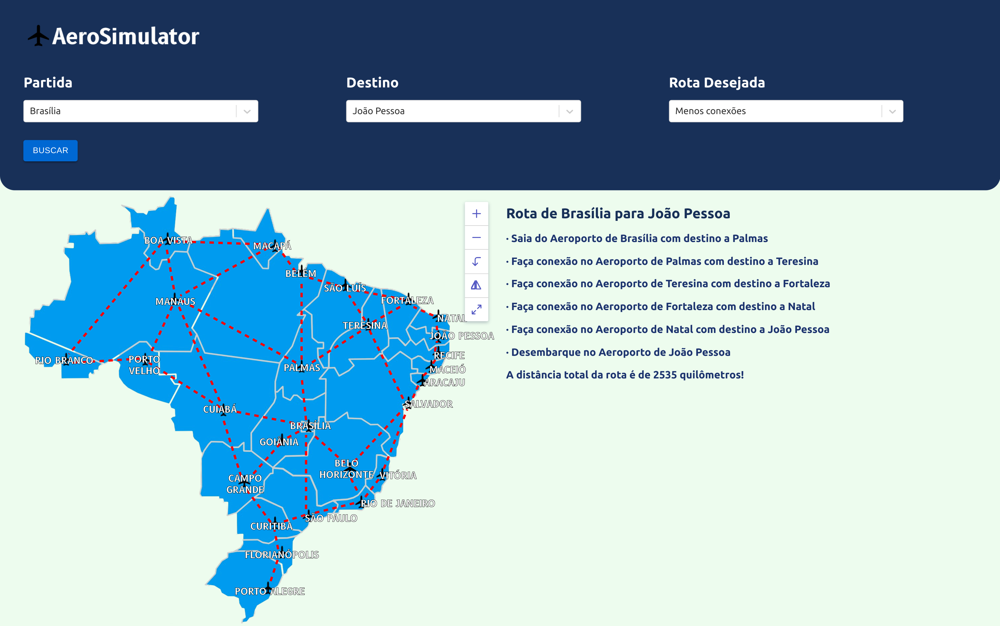
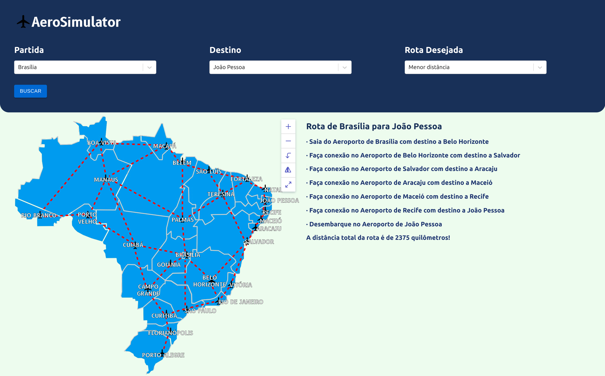
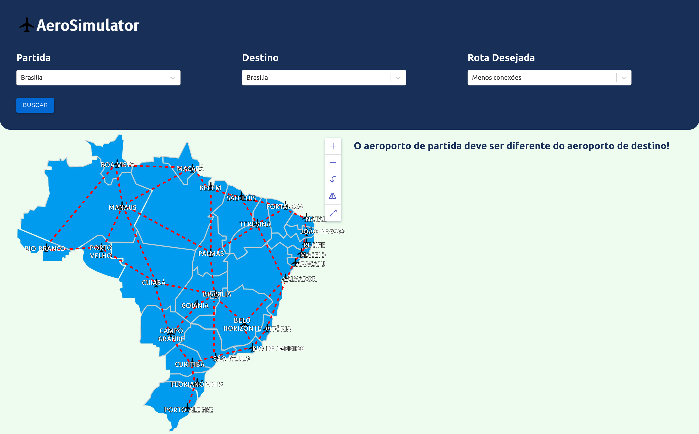
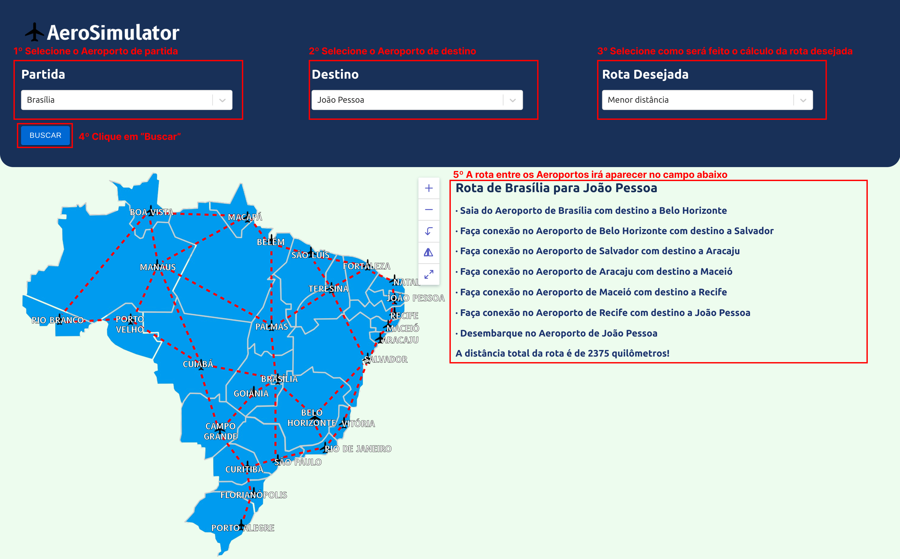

# AeroSimulator Evolved

**Conteúdo da Disciplina**: Grafos 2<br>

## Alunos

|Matrícula | Aluno |
| -- | -- |
| 19/0105267  |  Diógenes Dantas Lélis Júnior |
| 20/0018167  |  Gabriel Mariano da Silva |

## Sobre

O **AeroSimulator Evolved** busca apresentar a melhor rota entre dois aeroportos dados os pontos de partida e chegada! Além disso, a plataforma agora permite que o usuário escolha a opção mais adequada para o cálculo da rota desejada, isto é, é possível escolher entre a menor rota (em distância total) e a rota com menor número de conexões.

A primeira versão do [**AeroSimulator**](https://github.com/projeto-de-algoritmos/Grafos1_AeroSimulator) permitia apenas o cálculo da rota com menos conexões baseando-se no algoritmo de Busca em Largura em Grafos. A versão atual da plataforma apresentou evoluções no cálculo da rota com menos conexões, que agora apresenta a distância total da rota.

Além disso, foi implementada a funcionalidade de cálculo da rota com menor distância através do Algoritmo de *Dijkstra*, que permite a implementação de tal funcionalidade e ainda auxilia no retorno da distância total da rota apresentada!

Vale destacar que, tal qual a versão anterior da plataforma, para a implementação desta, os aeroportos foram interpretados como os "nós" do grafo e as conexões entre os aeroportos foram interpretadas como "arestas" do grafo. Os respectivos "pesos" de cada aresta do grafo são as distâncias entre os aeroportos da plataforma (tal informação é melhor apresentada abaixo, no tópico "Outros").

## Screenshots

### Exemplo de uso



### Exemplo de uso



### Exemplo de erro


### Exemplo de erro



## Instalação

**Linguagem**: *JavaScript*<br>
**Framework**: *React*<br>

## Como rodar o projeto?

Primeiramente, clone o repositório em sua máquina:

```
git clone git@github.com:projeto-de-algoritmos/Grafos2_AeroSimulatorEvolved.git
```

Após isso, entre na pasta do projeto e então entre na pasta *aerosimulator*, na qual o projeto está localizado:

```
cd Grafos2_AeroSimulatorEvolved/aerosimulator/
```

Em seguida, instale todas as dependências do projeto com o [**NPM**](https://docs.npmjs.com/downloading-and-installing-node-js-and-npm) (ou [**Yarn**](https://classic.yarnpkg.com/lang/en/docs/install/#debian-stable), caso prefira):

```
npm install
```

Caso não possua o **NPM** ou o **Node.js** instalados em sua máquina, veja o [**tutorial**](https://docs.npmjs.com/downloading-and-installing-node-js-and-npm#using-a-node-installer-to-install-nodejs-and-npm).

Por fim, para rodar o projeto, basta executar o *script* de *start*:

```
npm run start
```

O projeto será automaticamente executado e estará disponível em uma porta de sua máquina (geralmente a porta [3000](<http://localhost:3000>)).

## Uso

Primeiramente, selecione os aeroportos de partida e destino (que, por sua vez, não podem ser iguais). Após isso, caso queira calcular a rota com menos conexões (que se baseia no algoritmo de busca em largura em grafos), basta selecionar a opção "Menos conexões" na caixa de seleção da "Rota Desejada". Caso queira calcular a rota com menor distância (que se baseia no algoritmo de *Dijkstra*), basta selecionar a opção "Menor distância" na caixa de seleção da "Rota Desejada".

### Instruções de uso

As instruções de uso são bem semelhantes às da [primeira versão da plataforma](https://github.com/projeto-de-algoritmos/Grafos1_AeroSimulator), com o adicional de que agora o usuário deve escolher o critério com o qual a rota desejada será calculada.



## Apresentação

A apresentação do projeto realizada pela dupla pode ser assistida tanto no [YouTube por AQUI](https://youtu.be/p6oC6vScpKg) quanto pode ser baixada do próprio repositório e assistida [AQUI](media/grafos2_dupla14.mp4).

## Outros

### Evolução

Vale destacar que as evoluções seguiram em parte o que foi proposto na primeira versão do [**AeroSimulator**](https://github.com/projeto-de-algoritmos/Grafos1_AeroSimulator) na aba **"Outros"**, isto é, foi adicionada a possibilidade de escolha do critério de cálculo da rota, sendo um destes critérios o cálculo da rota desejada com menor distância física.

Todavia, para futuras versões ainda permanece a necessidade de refatoração da interface para adaptação aos conceitos de *UI/UX* e aos princípios de *Interação Humano-Computador*, haja vista que a evolução atual do **AeroSimulator** adotou uma abordagem mais voltada ao *back-end* em detrimento do *front-end*.

### Distância entre os aeroportos

Para o cálculo da distância aproximada entre os aeroportos apresentados na plataforma, primeiramente foi considerado que a distância entre estes seria a distância entre as capitais apresentadas em linha reta.

Para o cálculo da distância, foram utilizadas em conjunto duas ferramentas: a plataforma [**Distância entre as cidades**](https://www.distanciaentreascidades.com.br/) e a ferramenta de "medir distância" disponibilizada pelo [**Google Maps**](https://www.google.com.br/maps). A distância entre dois aeroportos representava o "peso" da aresta que ligava ambos.

### Possível solução de erros nas dependências

O presente tópico foi abordado na primeira entrega do projeto, estando presente ao final do [*README da primeira entrega*](https://github.com/projeto-de-algoritmos/Grafos1_AeroSimulator).

Todavia, permanecem as recomendações de verificação das dependências instaladas na máquina, pois a não-instalação destas impossibilita a execução da plataforma. Desta forma, garanta que o comando *npm install* foi executado.
